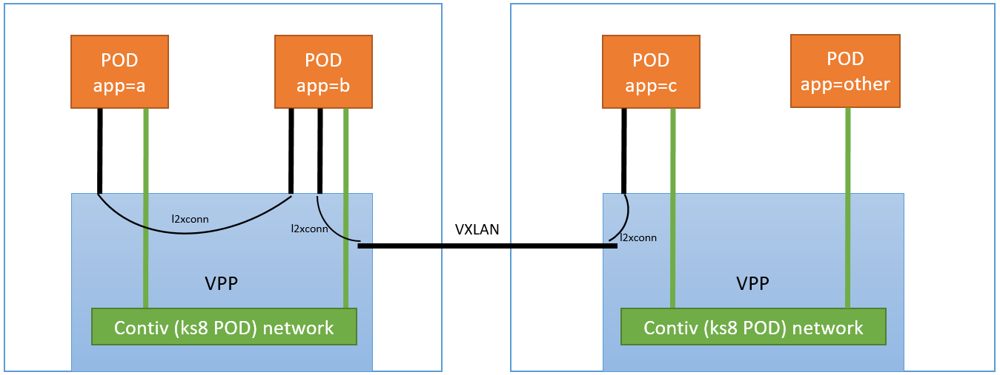
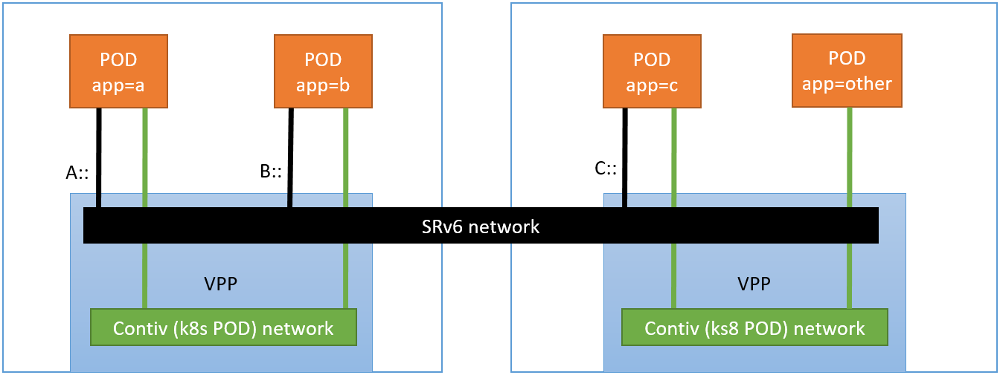
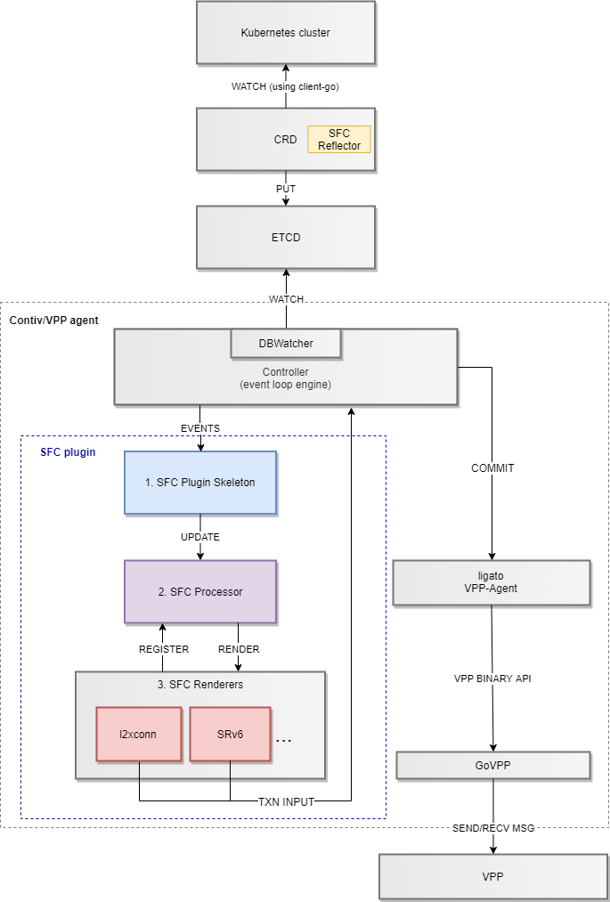

### Service Function Chaining in Contiv-VPP

Since Contiv-VPP CNI is aimed mostly for CNF deployments, we decided to support
service function chaining between the pods for CNF workloads directly on the CNI. 

A service function chain defines network interconnections between custom (additional) POD interfaces 
(see [custom interfaces README](../operation/CUSTOM_POD_INTERFACES.md)), and can be defined
as CRDs with references to the PODs via the pod labels, similarly as in k8s services
([example](../../k8s/crd/servicefunctionchain.yaml)).

Contiv-VPP will support several ways of rendering the service chains. For example,
a service function chain defined as an ordered list of pod labels `app=a, app=b, app=c`
can be rendered either using l2 cross-connects with VXLANs as follows:

or using SRv6 as follows:

## SFC Implementation details
SFC in Contiv-VPP is implemented similarly to [k8s services](SERVICES.md). It consists of
the following components:

 - **SFC reflector in KSR** - reflects SFC defined as CRDs into Contiv-ETCD
 - **SFC Processor** - processes service function chain definitions in abstract format
 (using k8s labels) to chains of actual running pod instances
 - **SFC Renderers** - render service chain instances into VPP configuration (wire,
 or "stitch" pod interfaces on VPP). The CNI may contain different SFC renderers,
 each one doing the stitching differently on VPP, but providing the same functionality,
 e.g. l2xconn renderer or SRv6 renderer.
 

## SFC implementation progress
**SFC in Contiv-VPP is still work in progress**. The progress is tracked in the following list:

- [X] define service function chain CRD API ([example](../../k8s/crd/servicefunctionchain.yaml))
- [x] SFC CRD reflector on KSR 
- [ ] SFC plugin skeleton + SFC Processor **(in progress)**
- [ ] SRv6 renderer **(assigned)**
- [ ] l2xconn renderer **(NOT assigned yet)**
