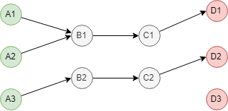
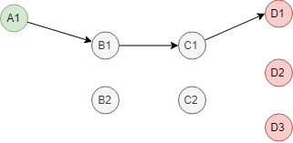
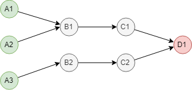
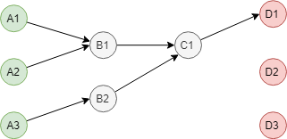
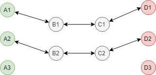
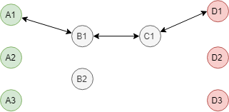

# L2-xconnect SFC Rendering Options

The l2xconn SFC renderer currently works with the following limitations:
1. It always renders a chain into a single data path, even if more replicas of some pods matching 
selectors in the chain are present.
2. The rendered data path may not be optimal in some cases, e.g. the traffic needs to traverse between 
more nodes than it would be necessary.

The current logic is implemented by the `getPreferredSFPod` and `getPreferredSFInterface` methods. 
To address the issues described above, these would need to be changed to a more sophisticated rendering algorithm,
that would:

- render multiple paths (multiple instances) for the same service chain, if more instances of some service
functions are available,
- if possible, select shortest path for service chains, where the "path" between two service functions is
assumed to be much longer inter-node than intra-node. Things like link utilization and error-rate on the 
link between two nodes can be taken into consideration as well.

Since L2 traffic cannot be effectively load-balanced between multiple interfaces on VPP, we have to assume 
that in order to have multiple instances of the same service chain, we need multiple traffic inputs - pods 
or external interfaces where the chain starts. Also, once traffic enters a (service function) pod, it always 
has to be forwarded to exactly one next service function pod / external interface.

## Examples - Unidirectional Chains

Let's use graph theory to discuss some particular rendering options for a L2 SFC. For the pictures below, 
let's assume that the SFC has been defined as a unidirectional chain between 4 service functions 
`A -> B -> C -> D`. `A` and/or `D` (input and output service functions) can be external interfaces or pods, 
`B` and `C`are pods. Each one of them can have multiple instances. Graph nodes represent the service functions, 
graph edges represent interconnections between them:

#### 3-2-2-3 replicas - 3 available paths:

This means we have 3 instances of the service chain, with is determined by the number of input nodes. 
Note the node `B1`: it can have multiple inputs, but only one output. Also note `C2`: it can only have one output, 
therefore the output node `D3` is disconnected. The picture shows one possible rendering, other renderings of 
this case are possible. The actual rendering should depend on weights applied to graph edges and shorter 
paths should be preferred.

#### 1-2-2-3 replicas - 1 available path:

If we have only one traffic source, we can only have one instance of the chain. The disconnected nodes act 
as a backup in case that one of the active nodes would crash.

#### 3-2-2-1 replicas - 3 available paths:

In this case we can have multiple paths, that would all end in a single output node.

#### 3-2-1-3 replicas - 3 available paths:

We again have multiple paths, that concentrate in the node `C1` and end in a single output node.

## Examples - Bidirectional Chains

The situation is little bit more complex if the service chains are bi-directional. In that case, 
we could use the same priciples as for uni-directional traffic, just apply it twice - in both directions. 
However, we need to take special attention to not render different paths one way and the way back, since 
most of the networking protocols do not like assymetric traffic routing. Simpler would be to use a different rule: 
only one input and only one output for each graph node. Let's take a look at a few rendering options:

#### 3-2-2-3 replicas - 2 available paths:

This means we have 2 instances of the service chain, with is determined by the minimum of the instances 
per service function (`B` and `C` have 2 instances).

#### 3-2-1-3 replicas - 1 available path:

There is only 1 instance of the service chain, with is determined by the minimum of the instances 
per service function (`C` has only 1 instance). Again, this rendering is only one of the available options, 
should be selected by the weights applied to graph edges and the shortest path should be preferred.
