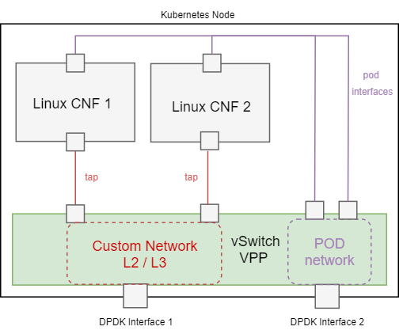

# Custom Networks in Contiv-VPP

This example showcases usage of custom networks for multi-interface pods in Contiv-VPP.
The main use-case for this feature are CNF deployments, where it can be combined with
[service function chaining](../sfc).

For more information on multi-interface pods in Contiv-VPP, look at the 
[custom pod interfaces documentation](../../../docs/operation/CUSTOM_POD_INTERFACES.md).

## Demo Topology
This demo deploys 2 CNF pods, each with one additional TAP interface in a layer 2 
custom network defined as a CRD. Additionally, an external DPDK interface is defined 
with another CRD, and is placed into the same custom network as well. This means that the 
CNF interfaces and the external DPDK interface will be interconnected in a bridge 
domain on VPP:



Note that this demo refers to a single-node k8s cluster deployment. If the CNFs are deployed
on different k8s nodes, they will be connected to different bridge domains, but still
interconnected on L2 layer using a VXLAN tunnel between the bridge domains 
(actually, this is not working now, but will be implemented soon).

This folder contains three yaml files:
  - [custom-network.yaml](custom-network.yaml) defines a L2 custom network with the name `l2net`
  - [cnfs-linux.yaml](cnfs-linux.yaml) defines CNF pods with additional interfaces in the `l2net`
  network (using the annotation `contivpp.io/custom-if: tap1/tap/l2net`)
  - [external-interface.yaml](external-interface.yaml) defines an external DPDK sub-interface
  in the `l2net` network.
  
### Setup
 Before deploying, [external interface deployment yaml](external-interface.yaml) needs to be modified 
 to match your setup:
 
 - change `node` identifier to match your hostname:
 - change `vppInterfaceName` identifier to match a DPDK interface on the particular node:
 
```yaml
  nodes:
    - node: k8s-master
      vppInterfaceName: GigabitEthernet0/a/0
```

Don't forget to [modify your VPP startup config file](../../../docs/setup/VPP_CONFIG.md) 
with the PCI address of the external interface.

## Demo
Start by deploying the yaml files:
 ```bash
kubectl apply -f custom-network.yaml
kubectl apply -f cnfs-linux.yaml
kubectl apply -f external-interface.yaml
```

Verify that `linux-cnf` pods are running:
```bash
$ kubectl get pods -o wide
NAME         READY   STATUS    RESTARTS   AGE   IP         NODE      NOMINATED NODE   READINESS GATES
linux-cnf1   1/1     Running   0          56m   10.1.1.4   lubuntu   <none>           <none>
linux-cnf2   1/1     Running   0          56m   10.1.1.5   lubuntu   <none>           <none>

```

Verify that CNF taps and DPDK sub-interface are all connected into the same bridge domain on the
vswitch VPP:
```bash
$ sudo vppctl
    _______    _        _   _____  ___ 
 __/ __/ _ \  (_)__    | | / / _ \/ _ \
 _/ _// // / / / _ \   | |/ / ___/ ___/
 /_/ /____(_)_/\___/   |___/_/  /_/    

vpp# sh inter addr
...
GigabitEthernet0/a/0.200 (up):
  L2 bridge bd-id 2 idx 2 shg 1  
...
tap5 (up):
  L2 bridge bd-id 2 idx 2 shg 1  
tap6 (up):
  L2 bridge bd-id 2 idx 2 shg 1  
```

Try sending some L2 broadcast traffic (e.g. ARP) from one of the CNFs or external interface.
You should see it coming to all other interfaces in the bridge domain.