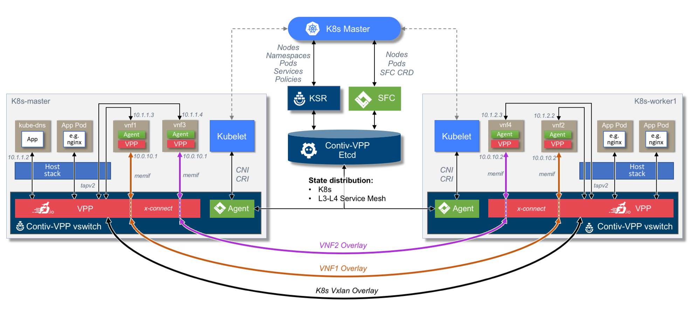

# Contiv - VPP SFC-CONTROLLER DEMO

*WARNING: This demo is outdated, please use Contiv-VPP integrated 
[SFC functionality](../sfc/README.md) instead.*


## Topology
The vagrant setup deploys the following topology. Two VNF service chains spanning 2 hosts, using memif interfaces and vxlan tunnel overlays. Tap interfaces are used for the management interface of the Pods.
 
 
## Quickstart
Get started with Contiv-VPP using the Vagrant environment:
* Use the [Contiv-VPP Vagrant Installation][1] instructions to start a 
  simulated Kubernetes cluster with a couple of hosts running in VirtualBox
  VMs. This is the easiest way to bring up a cluster for exploring the 
  capabilities and features of Contiv-VPP.
* For the Sfc-Controller demo, please use only a production environment (VirtualBox/VMWare Fusion)
   
### Deploying VNF(s) and/or Pods
To get started first ssh into the master node and browse into the sfc-controller folder: 
```
vagrant ssh k8s-master
cd /home/vagrant/gopath/src/github.com/contiv/vpp/k8s/examples/sfc-controller
```

To run the example, you will need to apply labels to your cluster's nodes. To do so, run the 
```
./set-node-labels
```

At this point we are ready to deploy the SFC-Controller: 
```
kubectl apply -f sfc-controller.yaml
```

Issue `kubectl get po -n kube-system` to verify that the sfc pod is up and running. Once ready proceed to 
the scenario cases

### Scenario 1
Deploy two L2PP service chains in two nodes. The four VNFs should be deployed on master and worker nodes. 
First you need to create two K8s config Maps, common for all the VNFs. 
```
cd /home/vagrant/gopath/src/github.com/contiv/vpp/k8s/examples/sfc-controller/vnf-pods
kubectl apply -f configMaps.yaml
```

When the configuration maps are ready issue the following commands:
```
kubectl apply -f vnf1.yaml
kubectl apply -f vnf2.yaml
kubectl apply -f vnf3.yaml
kubectl apply -f vnf4.yaml
```

Verify that VNFs are running on different nodes with:
```
kubectl get po -o wide
```

To verify that the configuration of the memif(s) are correct, enter the main vswitch from k8s-master.
_k8s-worker1 vswitch can be accessed by ssh'ing into the worker node and by using the same command_:
```
sudo vppctl
sh int
```

The result should be the following:
```
vpp# sh int
              Name               Idx       State          Counter          Count     
GigabitEthernet0/8/0              1         up       rx packets                   523
                                                     rx bytes                   92118
                                                     tx packets                   713
                                                     tx bytes                   98181
                                                     drops                          1
                                                     ip4                          522
local0                            0        down      
loop0                             3         up       rx packets                   521
                                                     rx bytes                   58449
                                                     tx packets                  1422
                                                     tx bytes                  125158
                                                     drops                          1
                                                     ip4                          521
loop1                             10        up       
memif1/1                          11        up       
memif1/3                          9         up       
tapcli-0                          2         up       rx packets                  2881
                                                     rx bytes                  445225
                                                     tx packets                  2458
                                                     tx bytes                  445672
                                                     drops                          9
                                                     ip4                         2872
                                                     ip6                            8
tapcli-1                          4         up       rx packets                  1457
                                                     rx bytes                  317302
                                                     tx packets                  1466
                                                     tx bytes                  320476
                                                     drops                         16
                                                     ip4                         1449
                                                     ip6                            8
tapcli-2                          6         up       rx packets                   269
                                                     rx bytes                   33453
                                                     tx packets                   349
                                                     tx bytes                   30838
                                                     drops                          9
                                                     ip4                          261
                                                     ip6                            8
tapcli-3                          7         up       rx packets                   242
                                                     rx bytes                   31668
                                                     tx packets                   347
                                                     tx bytes                   30684
                                                     drops                          8
                                                     ip4                          234
                                                     ip6                            8
vxlan_tunnel0                     5         up       rx packets                   521
                                                     rx bytes                   65743
                                                     tx packets                   711
                                                     tx bytes                   88175
vxlan_tunnel1                     8         up       
vxlan_tunnel2                     12        up       
```

You can also enter the VNF container by finding its docker ID and using the following commands:
```
docker ps | grep vnf
```

Use the docker ID to access the VNF:
```
docker exec -it $dockerID bash
```

Enter the VNF switch configuration:
```
vppctl -s localhost:5002
sh int
sh int addr
```

The conifugration should look like: 
```
root@vnf1:~# vppctl -s localhost:5002
    _______    _        _   _____  ___ 
 __/ __/ _ \  (_)__    | | / / _ \/ _ \
 _/ _// // / / / _ \   | |/ / ___/ ___/
 /_/ /____(_)_/\___/   |___/_/  /_/    

vpp# sh int
              Name               Idx       State          Counter          Count     
local0                            0        down      
memif0/1                          1         up       

vpp# sh int addr
local0 (dn):
memif0/1 (up):
  L3 10.0.10.1/24
```

Try to ping the second VNF in the service chain while inside the switch:
```
vpp# ping 10.0.10.2
64 bytes from 10.0.10.2: icmp_seq=2 ttl=64 time=39.6765 ms
64 bytes from 10.0.10.2: icmp_seq=3 ttl=64 time=33.9866 ms
64 bytes from 10.0.10.2: icmp_seq=4 ttl=64 time=24.0393 ms
64 bytes from 10.0.10.2: icmp_seq=5 ttl=64 time=39.2625 ms
Statistics: 5 sent, 4 received, 20% packet loss
vpp# 
vpp# 
vpp# sh int addr   
local0 (dn):
memif0/1 (up):
  L3 10.0.10.1/24
vpp# sh int        
              Name               Idx       State          Counter          Count     
local0                            0        down      
memif0/1                          1         up       rx packets                     5
                                                     rx bytes                     434
                                                     tx packets                     5
                                                     tx bytes                     434
                                                     drops                          6
                                                     ip4                            4
vpp# 
```


To clean up: 
```
kubectl delete po vnf1
kubectl delete po vnf2
kubectl delete po vnf3
kubectl delete po vnf4
```

#### The above scenario can also be combined with Pods that won't necessarily use memif interfaces. 
You can test a combined setup by deploying an nginx server and a simple web client pod. 

Run a nginx Pod with labels app=web and expose it at port 80:
```
kubectl run web --image=nginx --labels app=web --expose --port 80
```

Verify that the nginx pod is running and get its IP address: 
```
kubectl get po -o wide
```

Run a temporary Pod and make a request to web Service by using the IP address from the previous output:
```
$ kubectl run --rm -i -t --image=alpine test-$RANDOM -- sh
/ # wget -qO- http://ipaddress
```

[1]: ../../../vagrant/README.md


