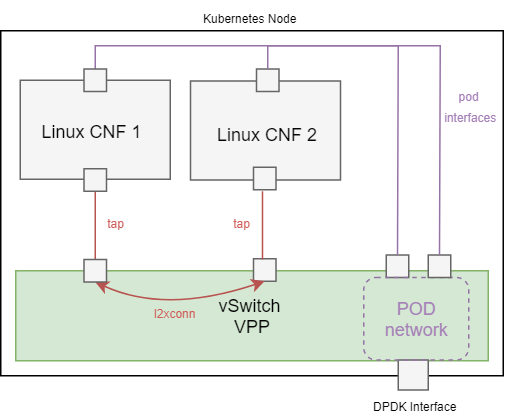
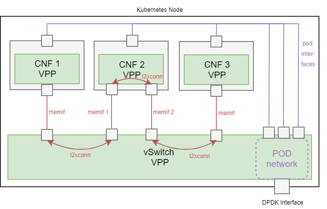
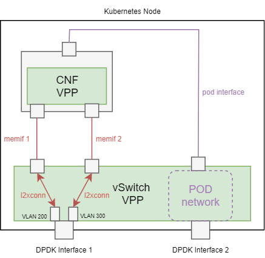

# Service Function Chaining (SFC) in Contiv-VPP

This example showcases Contiv-VPP integrated Service Function Chaining (SFC)
functionality between custom (additional) pod interfaces.

For more information on multi-interface pods and SFC in Contiv-VPP read:
 - [Custom pod interfaces information](../../../docs/operation/CUSTOM_POD_INTERFACES.md)
 - [SFC dev guide](../../../docs/dev-guide/SFC.md)


## Demo Topologies

There are 3 demo scenarios available in this folder:

- [Linux CNFs](#deployment-1---linux-cnfs): each CNF pod is connected with one additional 
tap interface  (see [cnfs-linux.yaml](cnfs-linux.yaml)):



- [VPP CNFs](#deployment-2---vpp-cnfs): each CNF pod runs its own VPP instance and is 
connected with one or two additional memif interfaces (see [cnfs-vpp.yaml](cnfs-vpp.yaml)):



- [External interfaces connected to CNF](#deployment-3---external-interfaces): a CNF
connected to external DPDK sub-interfaces via two additional memif interfaces:



In all cases, a service function chain interconnecting the pods is deployed using a CRD, see:
- [sfc-linux.yaml](sfc-linux.yaml) 
- [sfc-vpp.yaml](sfc-vpp.yaml)
- [sfc-external-interfaces.yaml](sfc-external-interfaces.yaml)

The additional tap/memif interfaces between the pods / external interfaces are inter-connected 
on L2 layer, using a l2 cross-connect on the vswitch VPP.

Of course, these 3 demo scenarios can be combined to form more complex SFC chains with mixed
types of service functions, but the aim of these examples is to keep the deployments simple.


### Limitations
 
Since SFC implementation in Contiv is still a work in progress, there are still several limitations
that will be addressed in the next releases:
- This demonstration currently works only if all the CNF pods are deployed both on the same k8s node. 
- The only custom interface networks supported as of now are "stub" and the "default" pod network.
- The only supported SFC chain rendering (interconnection between CNF pods) as of now is l2 cross-connect. 
SRv6 rendering is planned to be implemented as another alternative.


### Prerequisites

In k8s versions below 1.15, the Kubelet feature gate `KubeletPodResources`
needs to be enabled in order to use memif interfaces, 
e.g. the following has to be added into the `/etc/default/kubelet` file and Kubelet has to be restarted:
```
KUBELET_EXTRA_ARGS=--feature-gates KubeletPodResources=true
```

## Deployment 1 - Linux CNFs
This demo deploys 2 CNF pods, each with one additional tap interface. 
The pods run a busybox image, so that the pod networking can be reviewed
and tested.
 
Additionally, a service function chain interconnecting these 2 pods is deployed.
The secondary tap interfaces between the 2 podes are inter-connected on L2 layer,
using a l2 cross-connect on the vswitch VPP.


To start, deploy the following yaml files located in this directory:
 ```bash
kubectl apply -f cnfs-linux.yaml
kubectl apply -f sfc-linux.yaml
```

Two CNF pods should start:
```
$ kubectl get pods -o wide
NAME         READY   STATUS    RESTARTS   AGE   IP         NODE      NOMINATED NODE   READINESS GATES
linux-cnf1   1/1     Running   0          41s   10.1.1.4   lubuntu   <none>           <none>
linux-cnf2   1/1     Running   0          41s   10.1.1.5   lubuntu   <none>           <none>
```

In VPP vswitch CLI console, you should see 2 tap interfaces interconnected:
```
$ sudo vppctl
    _______    _        _   _____  ___ 
 __/ __/ _ \  (_)__    | | / / _ \/ _ \
 _/ _// // / / / _ \   | |/ / ___/ ___/
 /_/ /____(_)_/\___/   |___/_/  /_/    

vpp# sh inter addr
...
tap5 (up):
  L2 xconnect tap6
tap6 (up):
  L2 xconnect tap5
...
```

You can also connect to one of the two CNF pods and verify that 
there are two tap interfaces, one with the name `tap1` with no IP address:
```
$ kubectl exec -it linux-cnf1 sh
/ # ip addr
1: lo: <LOOPBACK,UP,LOWER_UP> mtu 65536 qdisc noqueue qlen 1000
    link/loopback 00:00:00:00:00:00 brd 00:00:00:00:00:00
    inet 127.0.0.1/8 scope host lo
       valid_lft forever preferred_lft forever
    inet6 ::1/128 scope host 
       valid_lft forever preferred_lft forever
89: eth0: <BROADCAST,MULTICAST,UP,LOWER_UP> mtu 1450 qdisc fq_codel qlen 1000
    link/ether 02:fe:dd:d4:54:84 brd ff:ff:ff:ff:ff:ff
    inet 10.1.1.4/32 brd 10.1.1.4 scope global eth0
       valid_lft forever preferred_lft forever
    inet6 fe80::d8e0:59ff:fe2a:683c/64 scope link 
       valid_lft forever preferred_lft forever
91: tap1: <BROADCAST,MULTICAST,UP,LOWER_UP> mtu 1450 qdisc fq_codel qlen 1000
    link/ether 02:fe:dd:d4:54:84 brd ff:ff:ff:ff:ff:ff
    inet6 fe80::b846:31ff:fe59:6031/64 scope link 
       valid_lft forever preferred_lft forever
/ # 
```

Since the secondary tap interfaces of the CNF pods were configured in "stub" network 
(see [cnfs-linux.yaml](cnfs-linux.yaml)), they were not configured with any IP address. 
To verify that the two CNFs are really interconnected
on L2 level, let's assign an IP address to one of them and send a ping to a non-existing
IP address within its subnet. We should see some packets (ARP requests) on the other CNF:

CNF 1:
```
$ kubectl exec -it linux-cnf1 sh
/ # ip addr add 1.2.3.4/24 dev tap1
/ # ping 1.2.3.5
PING 1.2.3.5 (1.2.3.5): 56 data bytes
^C
--- 1.2.3.5 ping statistics ---
3 packets transmitted, 0 packets received, 100% packet loss
/ # 
```

CNF 2:
```
$ kubectl exec -it linux-cnf2 sh
/ # ifconfig 
...
    tap1      Link encap:Ethernet  HWaddr 02:FE:DA:FD:C9:96  
              inet6 addr: fe80::6ca9:18ff:fef5:fb11/64 Scope:Link
              UP BROADCAST RUNNING MULTICAST  MTU:1450  Metric:1
              RX packets:14 errors:0 dropped:0 overruns:0 frame:0
              TX packets:11 errors:0 dropped:0 overruns:0 carrier:0
              collisions:0 txqueuelen:1000 
              RX bytes:992 (992.0 B)  TX bytes:866 (866.0 B)
```
(the RX packet counters should increment after you send some more pings)


## Deployment 2 - VPP CNFs
This demo deploys 3 CNF pods, CNF1 and CNF3 with one additional memif interface,
CNF2 with two additional memif interfaces.
There is a VPP running inside each one of the CNF pods, which is automatically
configured with the memif interface.
 
Additionally, a service function chain interconnecting these 3 pods is deployed.
The memif interfaces between the 3 pods are inter-connected on L2 layer,
using a l2 cross-connect on the vswitch VPP.


To start, deploy the following yaml files located in this directory:
 ```bash
kubectl apply -f cnfs-vpp.yaml
kubectl apply -f sfc-vpp.yaml
```

Two CNF pods should start:
```
$ kubectl get pods -o wide
NAMESPACE     NAME                       READY   STATUS    RESTARTS   AGE   IP          NODE   
default       vpp-cnf1                   1/1     Running   0          5s    10.1.1.4    lubuntu
default       vpp-cnf2                   1/1     Running   0          5s    10.1.1.5    lubuntu
default       vpp-cnf3                   1/1     Running   0          4s    10.1.1.6    lubuntu 
```

In VPP vswitch CLI console, you should see 4 memif interfaces interconnected:
```
$ sudo vppctl
    _______    _        _   _____  ___ 
 __/ __/ _ \  (_)__    | | / / _ \/ _ \
 _/ _// // / / / _ \   | |/ / ___/ ___/
 /_/ /____(_)_/\___/   |___/_/  /_/    

vpp# sh inter addr
...
memif1/0 (up):
  L2 xconnect memif2/0
memif1/1 (up):
  L2 xconnect memif3/0
memif2/0 (up):
  L2 xconnect memif1/0
memif3/0 (up):
  L2 xconnect memif1/1
...
```

You can also connect to any of the three CNF VPPs and verify that 
the memif interfaces are connected:
```
$ kubectl exec -it vpp-cnf1 -- vppctl -s :5002
    _______    _        _   _____  ___ 
 __/ __/ _ \  (_)__    | | / / _ \/ _ \
 _/ _// // / / / _ \   | |/ / ___/ ___/
 /_/ /____(_)_/\___/   |___/_/  /_/    

vpp# sh inter     
              Name               Idx    State  MTU (L3/IP4/IP6/MPLS)     Counter          Count     
local0                            0     down          0/0/0/0       
memif0/0                          1      up          9000/0/0/0     
```

Since the memif interfaces of the CNF pods were configured in "stub" network 
(see [cnfs-vpp.yaml](cnfs-vpp.yaml)), the memif interfaces were not configured 
with any IP address. To verify that the two CNFs are really interconnected
on L2 level, let's configure cross-connect between memif interfaces in CNF2, 
assign an IP address to memif interface in CNF1 and send a ping to a non-existing
IP address within that subnet. We should see some dropped packets (ARP requests) 
on the CNF3 VPP:

CNF2:
```
$ kubectl exec -it vpp-cnf2 -- vppctl -s :5002
    _______    _        _   _____  ___ 
 __/ __/ _ \  (_)__    | | / / _ \/ _ \
 _/ _// // / / / _ \   | |/ / ___/ ___/
 /_/ /____(_)_/\___/   |___/_/  /_/    

vpp# set interface l2 xconnect memif0/0 memif0/1
vpp# set interface l2 xconnect memif0/1 memif0/0       
```
Alternatively, the cross-connect can be created using the [CustomConfiguration CRD](../../../docs/operation/CUSTOM_CONFIGURATION.md):
```bash
kubectl apply -f xconnect-vpp.yaml
```

CNF 1:
```
$ kubectl exec -it vpp-cnf1 -- vppctl -s :5002
    _______    _        _   _____  ___ 
 __/ __/ _ \  (_)__    | | / / _ \/ _ \
 _/ _// // / / / _ \   | |/ / ___/ ___/
 /_/ /____(_)_/\___/   |___/_/  /_/    

vpp# set interface ip address memif0/0 1.2.3.4/24
vpp# ping 1.2.3.5

Statistics: 5 sent, 0 received, 100% packet loss
```

CNF3:
```
$ kubectl exec -it vpp-cnf3 -- vppctl -s :5002
    _______    _        _   _____  ___ 
 __/ __/ _ \  (_)__    | | / / _ \/ _ \
 _/ _// // / / / _ \   | |/ / ___/ ___/
 /_/ /____(_)_/\___/   |___/_/  /_/    

vpp# sh inter
              Name               Idx    State  MTU (L3/IP4/IP6/MPLS)     Counter          Count     
local0                            0     down          0/0/0/0       
memif0/0                          1      up          9000/0/0/0     rx packets                     5
                                                                    rx bytes                     210
                                                                    drops                          5
```

## Deployment 3 - External Interfaces
This demo deploys 2 external interfaces (VLAN subinterfaces of the same DPDK interface)
and a CNF pod which runs VPP inside of the pod. The pod is connected with 2 additional
memif interfaces, each connected to one of the external interfaces:


### Setup
 
 Before deploying, [external interface deployment yaml](external-interfaces.yaml) needs to be modified 
 to match your setup:
 
 - change `node` identifiers to match your hostname:
 - change `vppInterfaceName` identifiers to match a DPDK interface on the particular node:
 
```yaml
  nodes:
    - node: k8s-master
      vppInterfaceName: GigabitEthernet0/a/0
```

Don't forget to [modify your VPP startup config file](../../../docs/setup/VPP_CONFIG.md) 
with the PCI address of the external interface.

### Deployment

To start, deploy the following yaml files located in this directory:
 ```bash
kubectl apply -f external-interfaces.yaml
kubectl apply -f cnf-external-interfaces.yaml
kubectl apply -f sfc-external-interfaces.yaml
```

The CNF pod should start:
```
$ kubectl get pods -o wide
NAME      READY   STATUS    RESTARTS   AGE   IP          NODE         NOMINATED NODE   READINESS GATES
vpp-cnf   1/1     Running   0          69s   10.1.1.10   k8s-master   <none>           <none>
```

In VPP vswitch CLI console, you should see 2 external subinterfaces and a memif interface interconnected:
```
$ sudo vppctl
    _______    _        _   _____  ___ 
 __/ __/ _ \  (_)__    | | / / _ \/ _ \
 _/ _// // / / / _ \   | |/ / ___/ ___/
 /_/ /____(_)_/\___/   |___/_/  /_/    

vpp# sh inter addr
...
GigabitEthernet0/a/0 (up):
GigabitEthernet0/a/0.200 (up):
  L2 xconnect memif1/0
GigabitEthernet0/a/0.300 (up):
  L2 xconnect memif1/1
memif1/0 (up):
  L2 xconnect GigabitEthernet0/a/0.200
memif1/1 (up):
  L2 xconnect GigabitEthernet0/a/0.300
...
```
