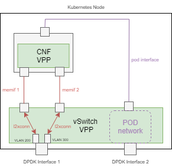

# Service Function Chaining (SFC) with External Interfaces

This example showcases Contiv-VPP integrated service function chaining (SFC)
between custom (additional) pod interfaces and pod-external DPDK interfaces.

For more info on SFC in Contiv read:
 - [Simpler SFC example](../README.md)
 - [SFC dev guide](../../../docs/dev-guide/SFC.md)

 ## Demo topology
 
 This demo deploys 2 external interfaces (VLAN subinterfaces of the same DPDK interface)
 and a CNF pod which runs VPP inside of the pod. The pod is connected with 2 additional
 memif interfaces, each connected to one of the external interfaces.



## Demo setup
 
 Before deploying, [external interface deployment yaml](external-interface.yaml) needs to be modified 
 to match your setup:
 
 - change `node` identifiers to match your hostname:
 - change `vppInterfaceName` identifiers to match a DPDK interface on the particular node:
 
```yaml
  nodes:
    - node: k8s-master
      vppInterfaceName: GigabitEthernet0/a/0
```

Don't forget to [modify your VPP startup config file](../../../../docs/setup/VPP_CONFIG.md) 
with the PCI address of the external interface.

## Deployment

To start, deploy the following yaml files located in this directory:
 ```bash
kubectl apply -f external-interface.yaml
kubectl apply -f cnf.yaml
kubectl apply -f sfc.yaml
```

The CNF pod should start:
```
$ kubectl get pods -o wide
NAME      READY   STATUS    RESTARTS   AGE   IP          NODE         NOMINATED NODE   READINESS GATES
vpp-cnf   1/1     Running   0          69s   10.1.1.10   k8s-master   <none>           <none>
```

In VPP vswitch CLI console, you should see 2 external subinterfaces and a memif interface interconnected:
```
$ sudo vppctl
    _______    _        _   _____  ___ 
 __/ __/ _ \  (_)__    | | / / _ \/ _ \
 _/ _// // / / / _ \   | |/ / ___/ ___/
 /_/ /____(_)_/\___/   |___/_/  /_/    

vpp# sh inter addr
...
GigabitEthernet0/a/0 (up):
GigabitEthernet0/a/0.200 (up):
  L2 xconnect memif1/0
GigabitEthernet0/a/0.300 (up):
  L2 xconnect memif1/1
memif1/0 (up):
  L2 xconnect GigabitEthernet0/a/0.200
memif1/1 (up):
  L2 xconnect GigabitEthernet0/a/0.300
...
```