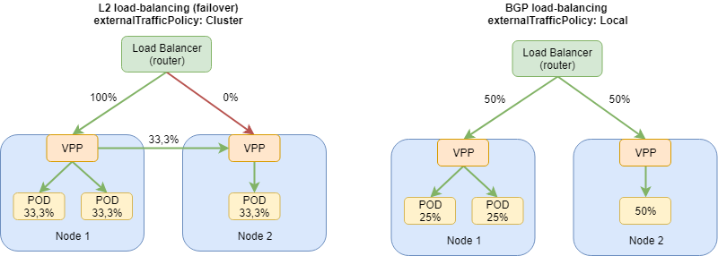

# LoadBalancer Services with MetalLB and Contiv-VPP

Contiv-VPP supports load balancing for 
`ClusterIP` and `NodePort` [k8s services](https://kubernetes.io/docs/concepts/services-networking/service/)
on VPP (as opposed to kube-proxy) out of the box. `LoadBalancer` services are supported
using the [MetalLB](https://metallb.universe.tf/) external load balancer.

[](../../docs/img/metallb.svg)

Currently, only L2 mode of MetalLB is supported in Contiv-VPP (left side of the picture). BGP
mode (right side of the picture) is doable as well, but not supported yet.

## Setup instructions
For programming VPP from MetalLB, we modified the MetalLB speaker code. The code
is available in [this repository](https://github.com/ccnf/metallb), and the Docker image on Dockerhub as 
[contivvpp/metallb-speaker](https://hub.docker.com/r/contivvpp/metallb-speaker/). 
The YAML files provided in this folder are already using this modified version.

The following setup is generic, but can be also used in our [vagrant setup](../../vagrant/README.md).


### 1. Deploy MetalLB components
```
$ kubectl apply -f metallb-vpp.yaml
```

Wait until all MetalLB PODs are running:
```
$ kubectl get pods -n metallb-system       
NAME                          READY   STATUS    RESTARTS   AGE
controller-8564575548-fpq7z   1/1     Running   0          43s
speaker-bj98p                 1/1     Running   0          43s
speaker-qsqvk                 1/1     Running   0          43s
speaker-x9tpj                 1/1     Running   0          43s
```

### 2. Configure L2 address pool
Modify `metallb-l2-config-vpp.yaml` file with IP address pool from which MetalLB will be
assigning addresses to LoadBalancer services. This needs to match your network setup,
and should fall into the `nodeInterconnectCIDR` subnet used for the Contiv-VPP deployment
(the subnet used for DPDK-enabled interfaces on VPP interconnecting the nodes).

```
$ cat metallb-l2-config-vpp.yaml
...
      addresses:
      - 192.168.16.150-192.168.16.250
...
```

Deploy the config map:
```
$ kubectl apply -f metallb-l2-config-vpp.yaml
```

### 3. Deploy and application with LoadBalancer Service
You can use the file `nginx-service.yaml` as an example, it deploys
3 replicas of the nginx server behind a LoadBalancer service.
```
$ kubectl apply -f nginx-service.yaml
```

### 4. Verify the deployment
Verify that the nginx service has been assigned an `EXTERNAL-IP` address
from the range configured in the step 2:
```
$ kubectl get svc  
NAME         TYPE           CLUSTER-IP     EXTERNAL-IP      PORT(S)        AGE
kubernetes   ClusterIP      10.96.0.1      <none>           443/TCP        9m59s
nginx        LoadBalancer   10.96.106.64   192.168.16.150   80:30980/TCP   10s
```

### 5. Verify the connectivity
From a node outside of the cluster, but on the same L2 network as the VPP
interfaces in your cluster, try accessing the service using the external IP.

If you used the [vagrant setup](../../vagrant/README.md) to test this deployment,
you can do that from the `k8s-gateway` node:

```
# this works only if you used the vagrant setup
$ vagrant ssh k8s-gateway

vagrant@k8s-gateway:~$ curl 192.168.16.150
<!DOCTYPE html>
<html>
<head>
<title>Welcome to nginx!</title>
...
```

You can also check the ARP entries on this node - the external IP of the nginx service 
should resolve to a MAC address of one of the VPP interfaces in your cluster:
```
vagrant@k8s-gateway:~$ arp -a
? (192.168.16.150) at 08:00:27:94:18:2a [ether] on enp0s8
```
