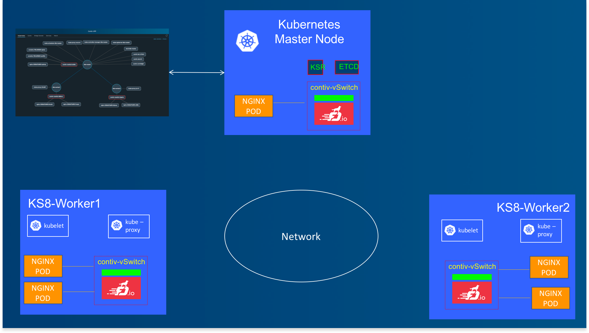
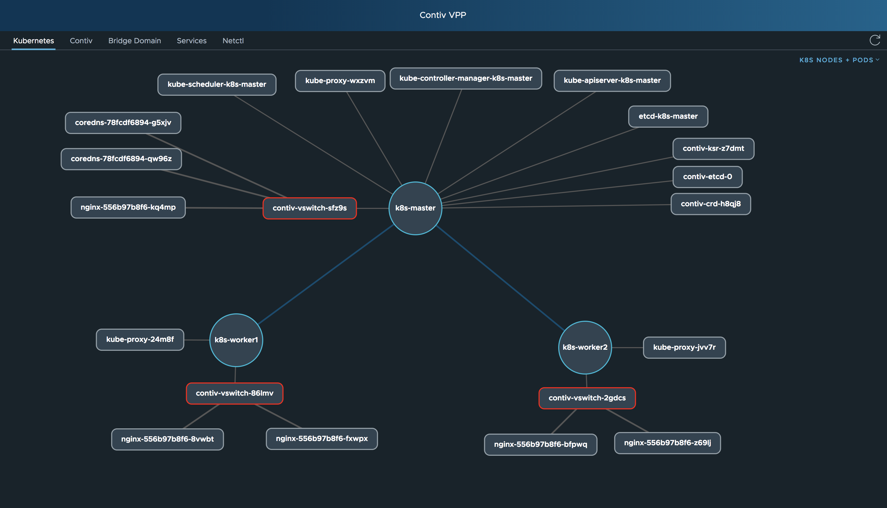
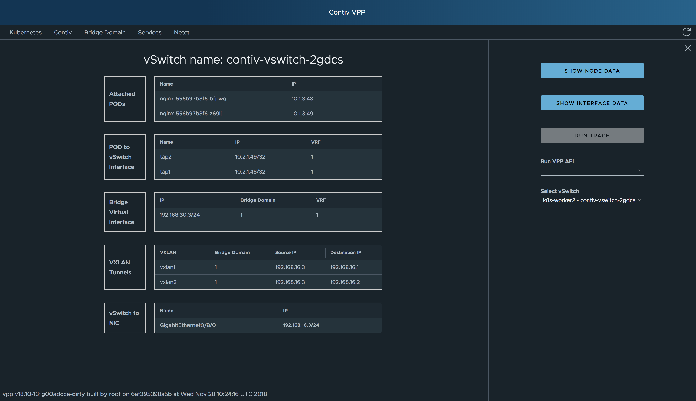
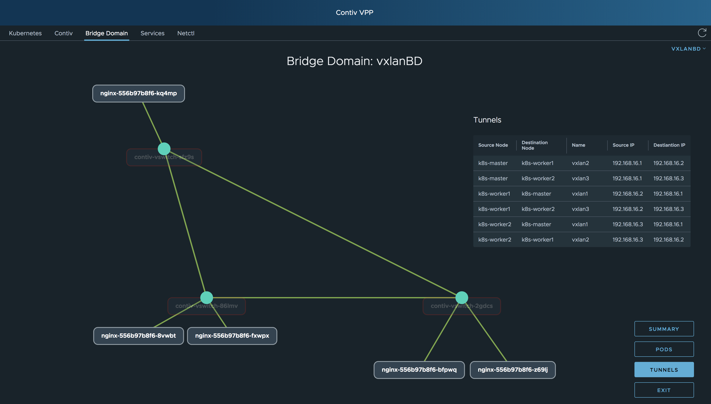
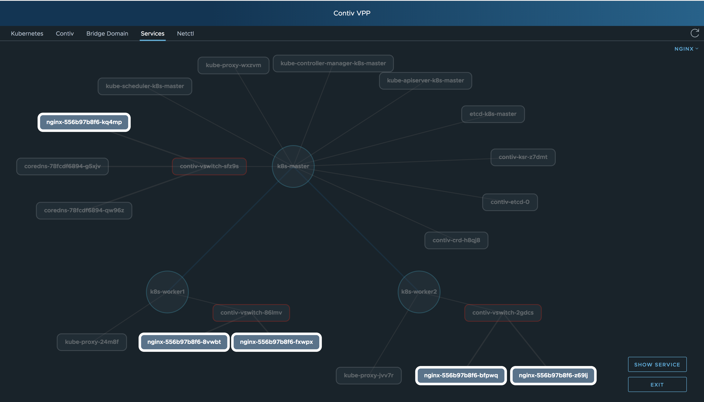

# Contiv VPP UI

Project page: https://contivpp.io/

This project was generated with [Angular CLI](https://github.com/angular/angular-cli) version 7.0.2.

## Start App

### Prerequisities

- Google Chrome - running with [disabled web security](https://stackoverflow.com/questions/3102819/disable-same-origin-policy-in-chrome) (Important for accessing the APIs).
    ##### -Command in OSX:
    Open -n -a "Google Chrome" --args --disable-web-security --user-data-dir=/tmp/chrome http://localhost:32500
    ##### -Command in Windows:
    In the "Run" app, enter: chrome.exe --user-data-dir="C://Chrome dev session" --disable-web-security http://localhost:32500
    ##### -Command in Linux:
    google-chrome --user-data-dir="/var/tmp/Chrome" --disable-web-security "http://localhost:32500"

- Vagrant
- VirtualBox
- Laptop w/ 16GB of memory
- [Postman](https://www.getpostman.com/) to look over [APIs](https://github.com/ligato/vpp-agent/tree/master/plugins/rest)

### Running

1. pull this repository (`git pull https://github.com/contiv/vpp.git`)
2. checkout kubecon2018 branch (`git checkout kubecon2018`)
3. cd into vpp/ui directory (`cd vpp/ui`)
4. from this directory run one of these commands:
- `./start.sh` for fully automated setup - run 2 workers in production enviroment without STN along with kubectl proxy
- `./start-professional.sh` for manual settings - need to specify workers and enviroment

When everything is deployed, navigate to `http://localhost:32500/` on Chrome with disabled web security - it should be automatically opened if installed.

Here is a picture of the demo topology.

### Accessing APIs

#### Postman collection
[Collection](./data/ContivVPP.postman_collection.json)

### Use 'vagrant ssh' to control nodes
After successful build, you can access created Kubernetes nodes CLI.

1. cd into vpp/vagrant (`cd /vpp/vagrant`)
2. from this directory run one of these commands:
- `vagrant ssh k8s-master` for accessing k8s-master node
- `vagrant ssh k8s-worker1` for accessing k8s-worker1 node
- `vagrant ssh k8s-worker2` for accessing k8s-worker2 node

For more details click [here](https://github.com/contiv/vpp/tree/kubecon2018/vagrant).

### Deploying pods/services

For deploying nginx pods/services [log into k8s-master node](#use-vagrant-ssh-to-control-nodes) and change directory to /vagrant (`cd /vagrant`).
All of these things can be also done via UI's Netctl terminal (no need to change directory).

#### nginx
From `/vagrant` directory run `./nginx-add` for adding nginx pods and services. To verify that everything is correctly deployed, run `kubectl get pods` and `kubectl get svc` in order to verify currently loaded application pods and services. If you want to remove nginx pods and services, you can run `./nginx-delete`.

#### busybox
- `cd /vagrant` in k8s-master
- `./busybox-add` for adding busyboxes
- `./busybox-delete` for deleting busyboxes

#### Testing nginx
Be sure that [nginx services](#nginx) are deployed.

- `cd /vagrant` in k8s-master

1. create testing busyboxes: `python create-client.py`
2. run test script: `python servrun.py` - you can see the cluster switching between different nginx IPs.
3. now you can delete testing busyboxes: `delete-client.py`

### Shutdown App
When you finished the work with the application, run `./stop.sh` from `vpp/ui` folder - this will shutdown all Vagrant instances.

### Wiping all data/settings

Run `./clear-all.sh` from vpp/ui directory for clearing all data and settings (destroy each Vagrant instance). After this command you need to follow [running steps](#running) from the 3rd point and build application again.

## Contivpp UI Screenshots Using the Demo App Cluster

View of 3 x node K8s cluster topology. Note the presence of contiv vSwitches in each node.

Assigned IP addresses and interfaces

Logical vxlan network overlay established by established by contivpp.io

Pods in the cluser belonging to a K8s service

