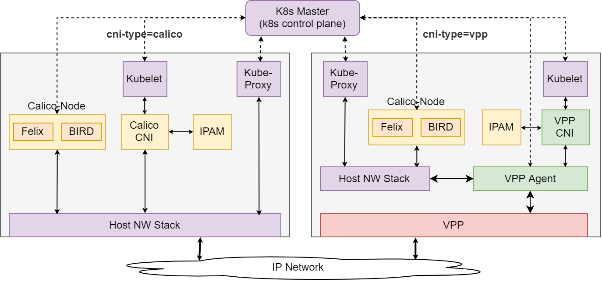

# Calico-VPP Deployment
This mode allows deployment of VPP in Calico clusters, where some of the nodes
can be running plain Calico (without VPP) and some of the nodes can be running
Calico with VPP (programmed using the components normally shipped with Contiv-VPP).
The desired CNI on the particular node can be specified using the labels; the nodes can be 
either labeled as `cni-type=calico` or `cni-type=vpp`. 

Both types of CNI use the same IPAM plugin, which avoids IP address conflicts and allows 
PODs running on non-VPP nodes to communicate with PODs running on VPP nodes as normally.

As of now, only no-overlay mode is supported, with BGP used to announce the POD subnets between
the nodes and the outside network.

[](../../docs/img/img/calico-vpp.png)

## Vagrant Deployment Steps

Use the `./vagrant-start` script and choose the `Calico-VPP` deployment:

```bash
$ ./vagrant-start 
Please provide the number of workers for the Kubernetes cluster (0-50) or enter [Q/q] to exit: 2

Please choose Kubernetes environment: 
1) Production
2) Development
3) Quit
--> 1
You chose Production environment

Please choose deployment scenario: 
1) Without StealTheNIC  3) Calico               5) Quit
2) With StealTheNIC     4) Calico-VPP
--> 4
You chose deployment with Calico-VPP
...
```

The master node is automatically labeled as `cni-type=calico`. The worker nodes are
waiting to be labeled as either `cni-type=calico` or `cni-type=vpp`. To label them, use
the `kubectl` tool on the master node:

```bash
$ vagrant ssh k8s-master

vagrant@k8s-master:~$ kubectl label node k8s-worker1 cni-type=calico
node/k8s-worker1 labeled

vagrant@k8s-master:~$ kubectl label node k8s-worker2 cni-type=vpp
node/k8s-worker2 labeled
```

Wait until all PODs are running and ready. This may take some time, since it pulls images 
from Dockerhub & looses connectivity to master when doing STN:

```bash
vagrant@k8s-master:~$ kubectl get pods --all-namespaces -o wide

NAMESPACE     NAME                                 READY     STATUS    RESTARTS   AGE       IP             NODE          NOMINATED NODE
kube-system   calico-node-8nzc7                    2/2       Running   0          1m        192.168.16.3   k8s-worker1   <none>
kube-system   calico-node-lklxr                    2/2       Running   0          11m       192.168.16.2   k8s-master    <none>
kube-system   calico-node-vpp-hljxl                1/2       Running   0          1m        192.168.16.4   k8s-worker2   <none>
kube-system   contiv-crd-jvlq5                     1/1       Running   0          11m       192.168.16.2   k8s-master    <none>
kube-system   contiv-etcd-0                        1/1       Running   0          11m       192.168.16.2   k8s-master    <none>
kube-system   contiv-ksr-bklfr                     1/1       Running   0          11m       192.168.16.2   k8s-master    <none>
kube-system   contiv-vswitch-c8l92                 1/1       Running   0          1m        192.168.16.4   k8s-worker2   <none>
kube-system   coredns-78fcdf6894-z52hv             1/1       Running   0          11m       10.10.0.3      k8s-master    <none>
kube-system   coredns-78fcdf6894-zsjq6             1/1       Running   0          11m       10.10.0.2      k8s-master    <none>
kube-system   etcd-k8s-master                      1/1       Running   0          10m       192.168.16.2   k8s-master    <none>
kube-system   kube-apiserver-k8s-master            1/1       Running   0          10m       192.168.16.2   k8s-master    <none>
kube-system   kube-controller-manager-k8s-master   1/1       Running   0          9m        192.168.16.2   k8s-master    <none>
kube-system   kube-proxy-f8bxp                     1/1       Running   0          3m        192.168.16.4   k8s-worker2   <none>
kube-system   kube-proxy-hcpkh                     1/1       Running   0          11m       192.168.16.2   k8s-master    <none>
kube-system   kube-proxy-xjm7s                     1/1       Running   0          5m        192.168.16.3   k8s-worker1   <none>
kube-system   kube-scheduler-k8s-master            1/1       Running   0          10m       192.168.16.2   k8s-master    <none>
```

Check Calico BGP status. It should contain an BGP peer item for each worker node and one more for the gateway:
```bash
vagrant@k8s-master:~$ sudo calicoctl node status

Calico process is running.

IPv4 BGP status
+----------------+-------------------+-------+----------+-------------+
|  PEER ADDRESS  |     PEER TYPE     | STATE |  SINCE   |    INFO     |
+----------------+-------------------+-------+----------+-------------+
| 192.168.16.100 | global            | up    | 13:03:44 | Established |
| 192.168.16.3   | node-to-node mesh | up    | 13:10:09 | Established |
| 192.168.16.4   | node-to-node mesh | up    | 13:10:59 | Established |
+----------------+-------------------+-------+----------+-------------+
```

Deploy applications as normally, the PODs will run either on non-VPP or on VPP nodes.
They should be able to communicate with each other as usually.


## Tainting the VPP Nodes
By default, any POD can be scheduled on any node. Taints can be used to force k8s
to schedule PODs on non-VPP nodes by default, and only deploy special PODs (which allow it
by a toleration) on VPP nodes. 


To taint `k8s-worker2` node so that the `cni-type=vpp` needs to be explicitly allowed to 
schedule a POD on that node:
```bash
vagrant@k8s-master:~$ kubectl taint nodes k8s-worker2 cni-type=vpp:NoSchedule
node/k8s-worker2 tainted
```

From this point, no more "standard" PODs should be scheduled on the `k8s-worker2` node. Let's check that
by deploying a nginx deployment with multiple replicas:

```bash
vagrant@k8s-master:~$ kubectl run nginx --image=nginx --replicas=4
deployment.apps/nginx created
```

Note that none of the nginx PODs was scheduled on the `k8s-worker2` node:
```bash
vagrant@k8s-master:~$ kubectl get pods -o wide
NAME                     READY     STATUS    RESTARTS   AGE       IP          NODE          NOMINATED NODE
nginx-64f497f8fd-8kvqk   1/1       Running   0          1m        10.10.1.3   k8s-worker1   <none>
nginx-64f497f8fd-926xw   1/1       Running   0          1m        10.10.1.2   k8s-worker1   <none>
nginx-64f497f8fd-q8zch   1/1       Running   0          1m        10.10.0.5   k8s-master    <none>
nginx-64f497f8fd-vdvss   1/1       Running   0          1m        10.10.0.4   k8s-master    <none>
```

To allow scheduling of a POD on a VPP node, specify the toleration in its definition. You can also 
combine it with a node selector, if you want to force the scheduler to place it on a VPP node
(the toleration itself allows deployment on a VPP node, but does not force it - it still may be
deployed on a non-VPP node as well):
```bash
apiVersion: v1
kind: Pod
metadata:
  name: vpp-app-nginx
spec:
  containers:
  - name: nginx
    image: nginx
  nodeSelector:
    cni-type: vpp
  tolerations:
    - key: "cni-type"
      operator: "Equal"
      value: "vpp"
      effect: "NoSchedule"
```

After deplyment of the above yaml, you can verify that it was indeed deployed on the VPP
node `k8s-worker2`:
```bash
vagrant@k8s-master:~$ kubectl get pods -o wide
NAME                     READY     STATUS    RESTARTS   AGE       IP          NODE          NOMINATED NODE
nginx-64f497f8fd-8kvqk   1/1       Running   0          6m        10.10.1.3   k8s-worker1   <none>
nginx-64f497f8fd-926xw   1/1       Running   0          6m        10.10.1.2   k8s-worker1   <none>
nginx-64f497f8fd-q8zch   1/1       Running   0          6m        10.10.0.5   k8s-master    <none>
nginx-64f497f8fd-vdvss   1/1       Running   0          6m        10.10.0.4   k8s-master    <none>
vpp-app-nginx            1/1       Running   0          48s       10.10.2.2   k8s-worker2   <none>
```
